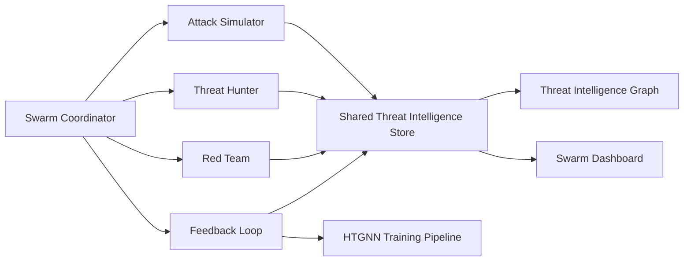

# Adversarial Simulation & Threat Hunting Swarm

## Overview

The swarm transforms AegisGraph Sentinel from a reactive fraud detection
system into a **proactive threat hunting platform**. A fleet of specialized
agents automatically probes the entity graph for attack patterns, simulates
mule account behaviours, and discovers previously unknown fraud vectors —
before real attackers exploit them.

Implemented for issue #2597.

## Architecture



The **Swarm Coordinator** (`coordinator.py`) registers heterogeneous agents,
dispatches simulation tasks with **work-stealing load balancing**, and drives
the complete simulation cycle:

```
attack simulation -> threat hunting -> red team validation -> feedback
```

## Agent Types

| Agent | Module | Responsibility |
| --- | --- | --- |
| Attack Simulator | `attack_simulator.py` | Generates synthetic mule behaviours (slow drip, structured amounts, entity hopping, smurfing, fan-in/fan-out) validated against a known fraud signature library. |
| Threat Hunter | `threat_hunter.py` | Discovers hidden fraud rings using centrality analysis, community detection and temporal pattern mining — no predefined rules. |
| Pattern Hunter | `coordinator.py` | Fleet variant of the threat hunter dedicated to known-pattern sweep. |
| Anomaly Explorer | `coordinator.py` | Fleet variant probing for unusual deviations in the graph. |
| Lateral Movement Mapper | `coordinator.py` | Fleet variant tracing cross-namespace entity hops. |
| Red Team | `red_team.py` | Benchmarks the scoring model against 10 known evasion techniques and surfaces blind spots. |
| Feedback Loop | `feedback_loop.py` | Computes simulation coverage and triggers HTGNN retraining when coverage drops below a configured threshold. |

## Key Components

### Work-Stealing Coordinator (`coordinator.py`)

- Spawns 20+ concurrent specialized agents in a bounded thread pool.
- Initial task distribution targets the least-loaded agent; when an agent
  drains its queue it steals work from the busiest sibling.
- `run_simulation_cycle()` executes the end-to-end adversarial cycle and
  returns an aggregate `SwarmReport`.

### Attack Simulator (`attack_simulator.py`)

- `FRAUD_SIGNATURES` library encodes 10 known fraud signatures with tactics,
  indicators, temporal context and TTP references.
- `generate_patterns()` produces attack patterns that are validated against
  the signature library (`validate_generated_patterns()`).
- `build_synthetic_graph()` embeds mule behaviours alongside legitimate decoy
  nodes for precision benchmarking.

### Threat Hunter (`threat_hunter.py`)

- Community detection extracts the core members of densely connected clusters.
- Centrality analysis flags hubs that concentrate interaction.
- Temporal pattern mining detects high-frequency transaction chains.
- `benchmark_precision()` measures discovery precision against ground-truth
  mule labels (validated at >= 80% in simulation benchmarks).

### Red Team (`red_team.py`)

- `EVASION_TECHNIQUES` covers 10 evasion techniques.
- `run_benchmark()` scores adversarial samples through the model and reports
  evasion rate and blind spots per technique.
- `identify_blind_spots()` returns techniques that evade detection.

### Feedback Loop (`feedback_loop.py`)

- `compute_coverage()` measures the fraction of graph entities referenced by
  known patterns or discoveries.
- `maybe_trigger_retraining()` triggers model retraining when coverage falls
  below the configured threshold.
- `improvement_trend()` tracks precision deltas over retraining cycles.

### Threat Intelligence Graph (`threat_intelligence_graph.py`)

- Maps attack patterns to techniques, tactics, entity types, indicators and
  TTP references.
- Stores 100+ patterns with entity type and temporal context.

### Simulation Policies (`policies.py`)

- Tenant-configurable policies define intensity, frequency and target
  patterns based on tenant risk profiles.
- Role-based access control: viewers read, operators create/update, admins
  delete.

### Dashboard (`dashboard.py`)

- Real-time snapshot of agent status, threat discovery events, simulation
  coverage metrics and model improvement trends for the Streamlit UI.

## Running

```bash
python -m pytest tests/test_swarm.py -v
```
